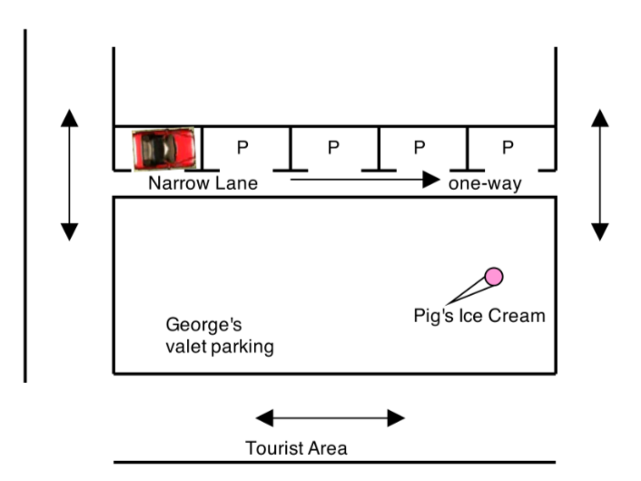
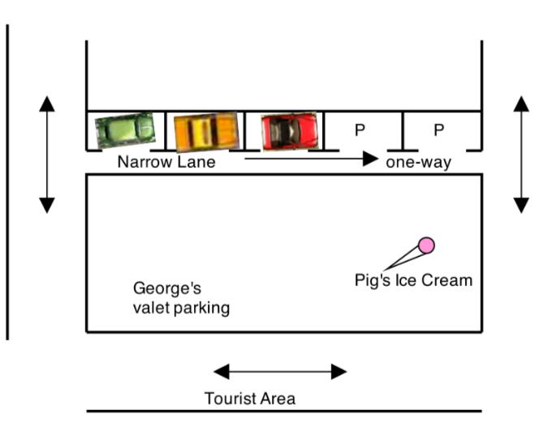
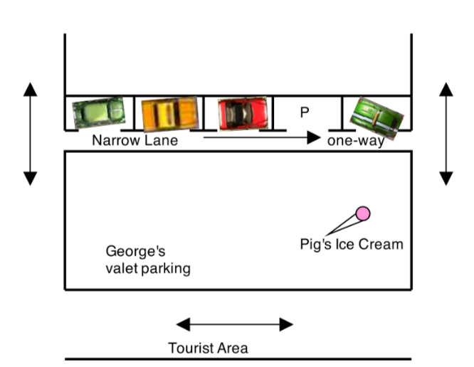

# These Pretzels are Making Me Thirsty

Due: Friday October 5, 23:59pm. 

Your friend George has come up with a genius money making idea involving parking cars in Charlottetown. George has found a one-way street in Charlottetown that has free parking. This street is one-way so people can only drive in one direction on the street.

The only problem is that the one-way street becomes impassable to other cars (since it is so narrow) if anyone parks on the street. George's plan is every morning (when the street is empty) to park in the leftmost (first) spot on the street - thus making the street impassable to all other cars. Now George controls the whole street and all of its valuable parking spots. George will offer valet parking for a fee to tourists and make use of the street that he controls (as seen below).

When a tourist asks George to park their car while they attend a local play, George will move his car to the right (forward) by one spot on the street and then park the customer's car into the vacated leftmost (first) spot - now there are two cars on the street and George still controls all (legal) access to the street.

In the sample picture below, George is the red car and he parks two customer cars on the street (in order) Yellow and Green:

When a customer wants their car back they tell George. George then gets in the rightmost (lead) car and drives it off the narrow street. He then asks the question is this the customer's car? If it is he gives them the car. Otherwise he parks that car back onto the street and repeats the process.

The street acts exactly like a Queue, first-in, first-out.

Wrinkle:

There is one wrinkle to George's otherwise genius idea (isn't there always), on occasion a local Charlottetown driver will break the traffic rules and they will drive into the rightmost spot on the narrow street (driving the wrong way down a one-way street for short distances is considered legal but only for Charlottetown drivers). 

When a local driver does this, George's street mimics a Stack:

Parking a new car onto the street works the same way (keeping in mind there is now one less available parking spot). Removing a customer car now works like this, George removes the leftmost car on the street (backing it off the one-way street) and asks, is this the customer's car. If it is he delivers them the car, and then moves all of the other cars back one spot (to maintain control of the street). If it is not the customer's car, George leaves the car temporarily off to the side and then removes the leftmost remaining car in the street and asks the same question. Once George finally finds the customer car he moves all of the remaining cars (on the street) towards the end of the left end of the street (to maintain control) and then parks the temporarily removed cars back on the street - maintaining their original order.

George only operates in Stack mode, when the end of the street is blocked because backing cars off the street is more difficult than driving the correct way.

Your task is to create a program that keeps track of all of the cars on the street. Such that at any time George can print out the exact order of cars on the street and at all times George occupies the first spot on the street.

This assignment has 3 possible grading schemes:

You must implement the provided StreetParking Interface in your solution and run and pass the provided test cases.

Note that by default the Street should have capacity 5 parking spaces (but this is configurable in the interface)

Possible implementations:

Implementation 1: Use a Deque<> from the JCF as the underlying data structure to implement the StreetParking Interface. A Deque gives the ability to access either end of the data structure. The maximum grade available for this implementation is 8.5/10

Implementation 2: Use a String array (String []) as the underlying data structure to implement the StreetParking Interface. An array gives access to anywhere in the data structure. You should align your cars (Strings) to be equal to the actual place they are parked on the street at any time. For example the first car on the street should be in the 0'th spot in the array. The maximum grade available for this implementation is 10/10

Implementation 3: Use doubly-linked nodes as the underlying data structure to implement the StreetParking interface. A doubly-linked node has a reference to both the previous and next nodes in the structure. Your class should maintain a reference to the first and last cars parked on the street  as well as a private inner Node class - so that the operations of parking and unparking cars is efficient. The maximum grade available for this implementation is 11/10.

An additional bonus point is available if anyone successfully implements more than 1 of the above options for a total grade of 12/10.

You are given a Driver program that simulates customers arriving and leaving, and also local drivers arriving and leaving from that last spot on the one-way street. The Driver program will compare your outputs with expected outputs. You should edit the driver to select and run tests for your actual implementation.

Grading Scheme:

Gradable | Points
--- | ---
Code Readability | 3pts
Code Design | 3Pts
Functionality | 4Pts

Code Readability: is indentation consistent, are naming conventions followed, are variable names well chosen and all methods commented properly

Code Design: is your solution efficient, contains proper classes, no methods over 100 lines, etc

Functionality: does your code pass all of the tests
